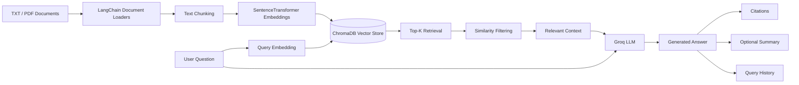

# RAG Pipeline with LangChain, ChromaDB & Groq

A hands-on **Retrieval-Augmented Generation (RAG)** project built with LangChain, Sentence Transformers, ChromaDB, and Groq.

This project demonstrates the complete RAG workflow: loading documents, splitting them into chunks, generating embeddings, storing vectors in a persistent vector database, retrieving relevant information, and using an LLM to generate context-aware answers.

The project starts with a basic RAG pipeline and gradually adds more advanced capabilities such as **similarity filtering, source tracking, citations, streaming responses, query history, and answer summarization**.

---

## Features

- Load `.txt` and `.pdf` documents using LangChain
- Split documents into smaller chunks
- Generate semantic embeddings using Sentence Transformers
- Store embeddings in a persistent ChromaDB vector database
- Perform semantic similarity search
- Retrieve Top-K relevant chunks
- Filter retrieved results using similarity scores
- Generate answers using Groq-hosted LLMs
- Return document sources and page numbers
- Add citations to generated answers
- Stream LLM responses
- Store query history
- Generate optional answer summaries
- Preserve vector data between sessions

---

## RAG Architecture



---

## Tech Stack

- Python
- LangChain
- LangChain Community
- LangChain Groq
- Sentence Transformers
- ChromaDB
- Hugging Face
- PyMuPDF / PyPDF
- NumPy
- Groq API
- Jupyter Notebook
- `uv` for Python environment and dependency management

---

## Project Structure

```text
RAG/
│
├── Data/
│   ├── PDF/
│   │   └── Data ethics.pdf
│   │
│   ├── txt_files/
│   │
│   └── vector_store/
│       └── Persistent ChromaDB data
│
├── Notebook/
│   └── document.ipynb
│
├── src/
│   └── rag/
│       └── __init__.py
│
├── .env
├── .gitignore
├── .python-version
├── pyproject.toml
├── uv.lock
├── requirements.txt
└── README.md
```

> The `.env` file contains the Groq API key and must never be committed to GitHub.

---

# RAG Pipeline

The project implements the RAG workflow in several stages.

## 1. Data Ingestion

The first step is loading documents from different sources.

Text files are loaded using LangChain's `DirectoryLoader` and `TextLoader`.

```python
from langchain_community.document_loaders import DirectoryLoader, TextLoader

dir_loader = DirectoryLoader(
    "../Data/txt_files",
    glob="**/*.txt",
    loader_cls=TextLoader,
    loader_kwargs={"encoding": "utf-8"},
    show_progress=False
)

documents = dir_loader.load()
```

PDF files are loaded using a PDF document loader such as `PyMuPDFLoader`.

```python
from langchain_community.document_loaders import DirectoryLoader, PyMuPDFLoader

pdf_loader = DirectoryLoader(
    "../Data/PDF",
    glob="**/*.pdf",
    loader_cls=PyMuPDFLoader,
    show_progress=False
)

pdf_documents = pdf_loader.load()
```

LangChain converts loaded files into `Document` objects containing:

```text
Document
│
├── page_content
│
└── metadata
```

The metadata can contain information such as:

```python
{
    "source": "../Data/PDF/Data ethics.pdf",
    "page": 3
}
```

---

## 2. Document Chunking

Large documents are divided into smaller chunks before embedding.

The project uses:

```python
RecursiveCharacterTextSplitter
```

Example:

```python
from langchain_text_splitters import RecursiveCharacterTextSplitter

text_splitter = RecursiveCharacterTextSplitter(
    chunk_size=500,
    chunk_overlap=50
)

chunks = text_splitter.split_documents(pdf_documents)
```

Chunk overlap helps preserve context between neighboring pieces of text.

The process becomes:

```text
Document
   ↓
Text Splitter
   ↓
Chunk 1
Chunk 2
Chunk 3
...
```

---

## 3. Embedding Generation

Each document chunk is converted into a numerical vector using:

```text
sentence-transformers/all-MiniLM-L6-v2
```

The model produces **384-dimensional embeddings**.

Example:

```text
Text
 ↓
SentenceTransformer
 ↓
[0.013, -0.028, 0.071, ..., 0.034]
```

The custom `EmbeddingManager` class handles model loading and embedding generation.

```python
from sentence_transformers import SentenceTransformer

model = SentenceTransformer(
    "sentence-transformers/all-MiniLM-L6-v2"
)

embeddings = model.encode(texts)
```

If 100 chunks are embedded, the result may have the following shape:

```text
(100, 384)
```

where:

```text
100 = number of chunks
384 = embedding dimensions
```

---

## 4. Vector Database

The project uses **ChromaDB** as the vector database.

A persistent client is created using:

```python
chromadb.PersistentClient(
    path="../Data/vector_store"
)
```

This means vector data remains available after the notebook or Python session is closed.

Each stored item can contain:

```text
ID
Embedding
Original Text
Metadata
Source
Page Number
Document Index
Content Length
```

A collection is created with:

```python
self.collection = self.client.get_or_create_collection(
    name="pdf_documents"
)
```

Documents are then inserted into the vector store.

---

## 5. Retrieval

When the user asks a question, the query is converted into an embedding using the same embedding model used for the documents.

```text
User Question
      ↓
Embedding Model
      ↓
Query Vector
      ↓
ChromaDB
      ↓
Nearest Document Vectors
```

The Retriever returns the most semantically similar chunks.

For example:

```python
results = retriever.retrieve(
    query,
    top_k=3
)
```

The returned result can contain:

```python
{
    "content": "...",
    "metadata": {...},
    "similarity_score": 0.82
}
```

---

# Simple RAG Pipeline

The basic RAG pipeline combines retrieval with the Groq LLM.

```python
def rag_simple(query, retriever, llm, top_k=3):

    results = retriever.retrieve(
        query,
        top_k=top_k
    )

    if not results:
        return "No relevant context found to answer the question."

    context = "\n\n".join(
        doc["content"]
        for doc in results
    )

    prompt = f"""
Use only the following context to answer the question.

Context:
{context}

Question:
{query}

Answer:
"""

    response = llm.invoke(prompt)

    return response.content
```

The complete flow is:

```text
User Question
      ↓
Retriever
      ↓
Vector Database
      ↓
Relevant Chunks
      ↓
Context
      +
Question
      ↓
Groq LLM
      ↓
Final Answer
```

Example:

```python
question = "What is data ethics?"

answer = rag_simple(
    query=question,
    retriever=rag_retriever,
    llm=llm,
    top_k=3
)

print(answer)
```

---

# Enhanced RAG Pipeline

The enhanced RAG pipeline adds additional information to the output.

It can return:

- Generated answer
- Source file
- Page number
- Similarity score
- Retrieved text preview
- Retrieval confidence
- Full retrieved context

Example:

```python
result = rag_advanced(
    query="What are the main principles of data ethics?",
    retriever=rag_retriever,
    llm=llm,
    top_k=3,
    min_score=0.1,
    return_context=True
)
```

Example output structure:

```python
{
    "answer": "...",

    "sources": [
        {
            "source": "../Data/PDF/Data ethics.pdf",
            "page": 4,
            "score": 0.78,
            "preview": "..."
        }
    ],

    "confidence": 0.78,

    "context": "..."
}
```

The `min_score` parameter filters weak retrieval results.

For example:

```text
Similarity Scores

0.89  → Keep
0.74  → Keep
0.51  → Keep
0.18  → Remove
0.09  → Remove
```

when:

```python
min_score = 0.2
```

> The confidence value represents the highest retrieval similarity score. It is not a calibrated probability that the LLM answer is correct.

---

# Advanced RAG Pipeline

The `AdvancedRAGPipeline` class extends the RAG system with additional functionality.

```python
adv_rag = AdvancedRAGPipeline(
    retriever=rag_retriever,
    llm=llm
)
```

Example query:

```python
result = adv_rag.query(
    question="What are the ethical challenges of data collection?",
    top_k=3,
    min_score=0.1,
    stream=True,
    summarize=True
)
```

The advanced pipeline supports:

### Streaming

The answer can be displayed while the Groq LLM is generating it.

```python
for chunk in self.llm.stream(prompt):
    print(
        chunk.content,
        end="",
        flush=True
    )
```

This provides a more interactive user experience.

---

### Citations

Retrieved chunks are numbered and provided to the LLM as context.

Example:

```text
[1]
Source: Data ethics.pdf
Page: 3

Retrieved document content...


[2]
Source: Data ethics.pdf
Page: 7

Retrieved document content...
```

The LLM can then generate answers containing citations such as:

```text
Data privacy is one of the major concerns in responsible
data management [1], while fairness is important when
designing automated decision systems [2].
```

The output also includes a source list:

```text
Sources:

[1] Data ethics.pdf (page 3)
[2] Data ethics.pdf (page 7)
```

---

### Query History

The pipeline stores information about previous queries during the current session.

Each history item contains:

```python
{
    "question": question,
    "answer": answer,
    "sources": sources,
    "confidence": confidence,
    "summary": summary
}
```

The latest query can be accessed with:

```python
adv_rag.history[-1]
```

> The current history implementation acts as a session log. It is not yet used as conversational memory for follow-up questions.

---

### Answer Summarization

The pipeline can optionally generate a short summary of the answer.

```python
summary_prompt = f"""
Summarize the following answer in exactly
2 short sentences.

Answer:
{answer}
"""
```

This feature can be enabled using:

```python
summarize=True
```

---

# Groq LLM Integration

The project uses LangChain's Groq integration.

```python
from langchain_groq import ChatGroq
```

The LLM can be initialized as follows:

```python
llm = ChatGroq(
    model="openai/gpt-oss-20b",
    temperature=0.1,
    max_tokens=1024
)
```

The Groq API key is stored as an environment variable.

---

# Environment Variables

Create a `.env` file in the root directory:

```text
GROQ_API_KEY=your_groq_api_key_here
```

The notebook loads it using:

```python
import os
from dotenv import load_dotenv

load_dotenv("../.env")

groq_api_key = os.getenv("GROQ_API_KEY")
```

You can safely verify that the key was loaded using:

```python
print(groq_api_key is not None)
```

Expected output:

```text
True
```

Do not print the actual API key.

---

# Installation

## 1. Clone the Repository

```bash
git clone <YOUR_REPOSITORY_URL>
cd RAG
```

---

## 2. Install Dependencies

This project uses `uv` for dependency management.

If `uv` is already installed:

```bash
uv sync
```

This installs the dependencies defined in:

```text
pyproject.toml
uv.lock
```

---

## 3. Create the `.env` File

Create:

```text
.env
```

inside the project root and add:

```text
GROQ_API_KEY=your_groq_api_key_here
```

---

## 4. Open the Notebook

Open:

```text
Notebook/document.ipynb
```

Select the project's `.venv` environment as the Jupyter kernel.

Then run the notebook cells in order.

---

# Security

Never commit API keys or secrets to GitHub.

The `.gitignore` file should contain:

```gitignore
.env
.venv/
__pycache__/
.DS_Store
```

Before pushing the repository, always check:

```bash
git status
```

The `.env` file should not appear in the files being committed.

A safe `.env.example` file can be added instead:

```text
GROQ_API_KEY=your_groq_api_key_here
```

If an API key is accidentally pushed to GitHub, revoke it immediately and generate a new one.

---

# RAG Workflow Summary

The complete project pipeline can be summarized as:

```text
                DOCUMENT INGESTION
                       │
                       ▼
                 TXT / PDF Files
                       │
                       ▼
              LangChain Loaders
                       │
                       ▼
                 Documents
                       │
                       ▼
                Text Chunking
                       │
                       ▼
                    Chunks
                       │
                       ▼
             SentenceTransformer
                       │
                       ▼
                  Embeddings
                       │
                       ▼
                   ChromaDB
                       │
                       │
User Question ─────────┘
      │
      ▼
Query Embedding
      │
      ▼
Similarity Search
      │
      ▼
Top-K Results
      │
      ▼
Score Filtering
      │
      ▼
Relevant Context
      │
      ├──────────► Sources
      │
      ├──────────► Similarity Scores
      │
      ▼
Context + Question
      │
      ▼
Groq LLM
      │
      ▼
Generated Answer
      │
      ├──────────► Citations
      ├──────────► Summary
      └──────────► Query History
```

---

# Possible Future Improvements

- Add conversational memory for follow-up questions
- Add metadata-based filtering
- Add a reranking model after vector retrieval
- Add hybrid keyword + semantic search
- Compare multiple embedding models
- Add RAG evaluation metrics
- Add automated document ingestion
- Support multiple document collections
- Add a Streamlit user interface
- Add a FastAPI backend
- Move reusable classes from the notebook into `src/rag/`
- Add automated tests
- Add Docker support
- Add cloud deployment
- Add authentication and user sessions

---

# Learning Objectives

This project was created to understand the main concepts behind modern Retrieval-Augmented Generation systems, including:

```text
Document Loading
      ↓
Chunking
      ↓
Embeddings
      ↓
Vector Databases
      ↓
Semantic Search
      ↓
Retrieval
      ↓
Prompt Construction
      ↓
LLM Generation
      ↓
Citations and Sources
```

It provides a practical foundation for building more advanced AI applications that combine private or domain-specific knowledge with Large Language Models.

---

# Author

**Hamed Goldoust**

GitHub: [Clonerhamed](https://github.com/Clonerhamed)

Linkedin : [Hamed_Goldoust](https://www.linkedin.com/in/hamed-goldoust/)

---

## License

This project is currently intended for educational and portfolio purposes.

A formal open-source license can be added in the future if the project is distributed or reused publicly.
